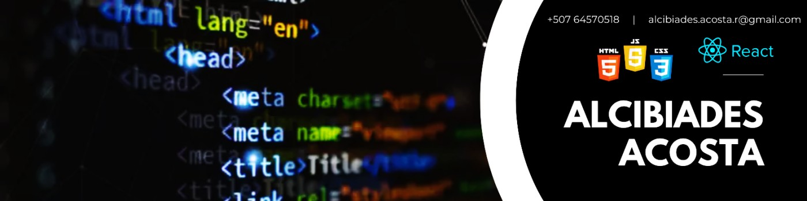

<h3 align="start">"Learning to code is not just about mastering a skill, it's about embracing a journey of perpetual growth."</h3>

# 💫 About Me:
Hello! 👋 I am Alcibiades Acosta, a web layout from Panama, with the passion of becoming a fullstack developer and eager to learn and participate in exciting projects. I love turning ideas into exceptional digital experiences, and I'm here on GitHub to connect with creative teams and collaborate on building the digital future. Let's create something extraordinary together! 💻✨

 - 🌱 I’m currently learning **full-stack development**  - 💬 Ask me about **HTML, CSS, JavaScript, and React!**  - 📫 How to reach me **alcibiades.acosta.r@gmail.com**

## <b> Socials </b>
  

## 💻 Tech Stack 
     

# 📊 GitHub Stats:
 
 

### 🔝 Top Contributed Repo

---

<!-- Proudly created with GPRM ( https://gprm.itsvg.in ) -->
